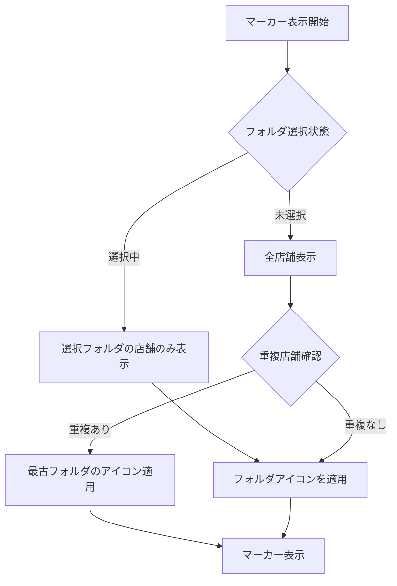
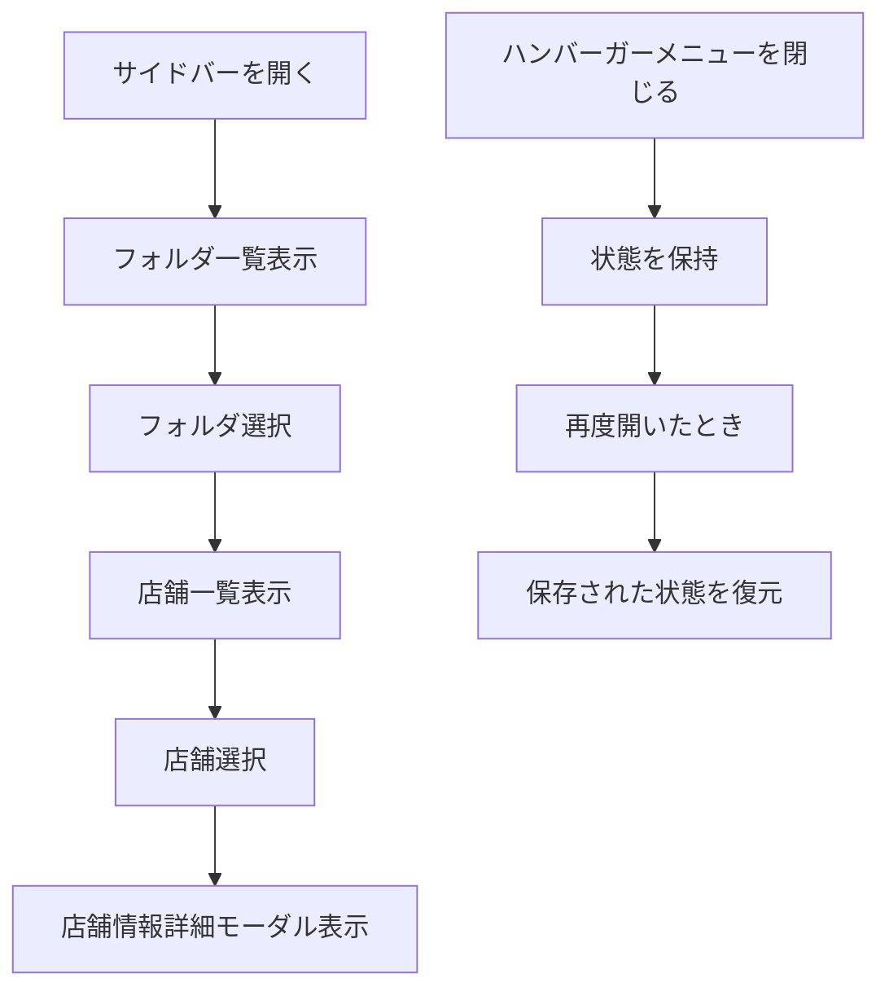
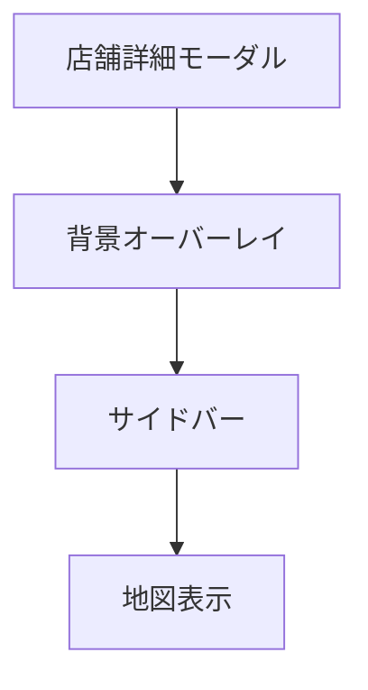

# TastyNote UI/UX詳細仕様書

## 1. マップ操作仕様

### 1.1 マーカー表示
#### 1.1.1 基本仕様
- マップ上の店舗位置にカスタムマーカーを表示
- マーカーのデザインはフォルダのアイコンと同一
- 表示優先順位：フォルダID（作成日時）が低い順

#### 1.1.2 マーカー表示ルール

### 1.2 インタラクション
- マーカークリック時：店舗詳細モーダルを表示
- フォルダ選択時：該当フォルダの店舗のマーカーのみを表示
- マーカーのホバー時：店舗名をツールチップで表示

## 2. サイドバー仕様

### 2.1 基本レイアウト
#### 2.1.1 デスクトップ表示
- 常時表示
- 画面左側に固定
- スクロール可能な領域として実装

#### 2.1.2 モバイル表示
- ハンバーガーメニューとして実装
- 画面左から70%幅で展開
- スライドアニメーション：0.3秒
- 背景オーバーレイ：透明度50%

### 2.2 サイドバー操作フロー

### 2.3 フォルダ選択時のサイドバーレイアウト
#### 2.3.1 ヘッダーエリア
- 「←戻る」ボタン：フォルダ一覧に戻る
- フォルダ名の表示
- 共有ボタン（アイコン）
  - 共有設定のON/OFF切り替え
  - URLコピーボタン（ON時のみ表示）
  - ソーシャル連携
    - Twitter共有
    - LINE共有

#### 2.3.2 コンテンツエリア（店舗カード）
- 店舗基本情報表示
  - 店舗名
  - 営業時間（現在営業中か）
  - 種別（ラーメン、焼肉、寿司、居酒屋、バー、カフェ、など）
- Places API写真サムネイル（利用可能な場合）
- メモプレビュー（2行まで表示、以降は「...」で省略）
- スクロール可能な領域として実装

#### 2.3.3 フッターエリア
- ログアウトボタン配置

### 2.4 ヘッダー仕様
#### 2.4.1 基本レイアウト
- TastyNoteロゴ（左寄せ）
- ハンバーガーメニュー
  - モバイル：通常表示
  - PC：デフォルトで展開状態

#### 2.4.2 検索機能
- 検索バー（中央配置）
- 検索ボタン
- 検索結果の表示
  - 1件以上：モーダルで結果表示
  - 0件/エラー：トーストメッセージで通知

### 2.5 フッター仕様
#### 2.5.1 共通フッター
- TastyNoteロゴ
- ソーシャルリンク
  - Twitterアイコン＆リンク
  - GitHubアイコン＆リンク
- ドキュメントリンク
  - プライバシーポリシー
  - 利用規約

### 2.3 状態遷移
- フォルダ選択時：店舗一覧に切り替え
- 戻るボタン：フォルダ一覧に戻る
- モーダル表示時：サイドバーは開いたまま

## 3. 店舗詳細モーダル仕様

### 3.1 表示トリガー
- マップ上のマーカークリック
- 検索結果からの選択
- フォルダ内店舗一覧からの選択

### 3.2 表示コンテンツ
#### 3.2.1 基本情報
- 店舗名
- 住所
- 電話番号
- 営業時間
- Google Maps リンク

#### 3.2.2 カスタム情報
- 登録フォルダ一覧
- メモ（500文字まで）
- 写真（最大5枚）

### 3.3 操作機能
- フォルダへの追加・削除
- メモの追加・編集
- 写真のアップロード・削除
- モーダルの閉じるボタン

### 3.4 表示優先順位

## 4. レイアウトの詳細仕様

### 4.1 画面サイズ別の挙動
| 要素         | モバイル     | タブレット | デスクトップ |
| ------------ | ------------ | ---------- | ------------ |
| サイドバー幅 | 70%          | 320px      | 320px        |
| 表示形式     | ハンバーガー | 可変       | 固定         |
| モーダル幅   | 90%          | 80%        | 600px        |
| マップ領域   | 全画面       | 右側可変   | 右側固定     |

### 4.2 z-index階層
1. 店舗詳細モーダル (z-index: 1000)
2. モーダル背景 (z-index: 900)
3. サイドバー (z-index: 800)
4. サイドバー背景 (z-index: 700)
5. マップコントロール (z-index: 600)
6. 地図ベース (z-index: 1)

## 5. エラーハンドリング

### 5.1 想定されるエラー
1. マップ操作関連
   - マーカー表示失敗
   - 位置情報取得エラー
   - Google Maps API エラー

2. UI操作関連
   - モーダル表示失敗
   - サイドバー展開失敗
   - アニメーション処理エラー

### 5.2 エラー時の対応
- ユーザーへの適切なメッセージ表示
- 代替表示の提供
- 自動リトライ機能の実装
- エラーログの記録