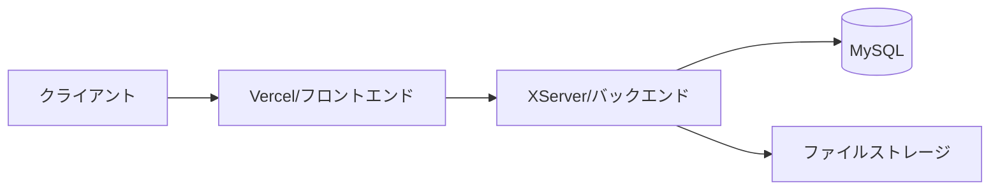
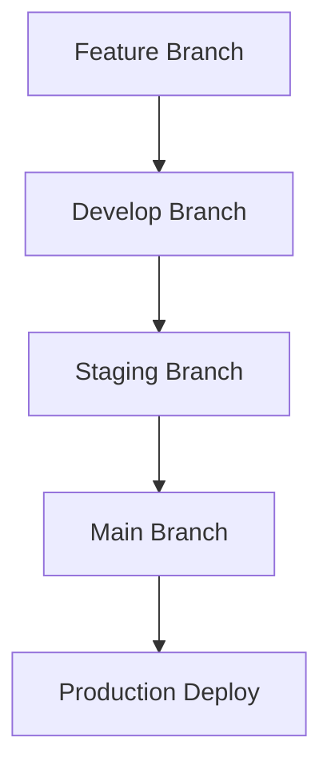

# TastyNote 基本仕様書

## 前提条件
本サービスは以下の条件の下で開発・運用されます：

- 個人開発のポートフォリオとして位置づけ
- 商用利用は想定しない
- 小規模アプリケーションとして運用（想定ユーザー30名程度）
- 低予算での開発・運用を前提
- メンテナンスコストを最小限に抑制
- できるだけシンプルな機能構成を維持

## 1. サービス概要
- ユーザーが食事とお酒を楽しめるお店の情報を記録・共有できるWebサービス
- 店舗情報を地図上で管理し、フォルダで整理・共有できる
- モバイルファーストのUI設計（8割以上がスマートフォンからの利用を想定）

### 1.1 開発フェーズ
Phase 1: コア機能（2ヶ月）
- ユーザー認証
- 店舗検索・登録
- 基本的なフォルダ管理

Phase 2: 追加機能（1.5ヶ月）
- 写真管理機能
- フォルダ共有機能
- メモ機能の拡張

Phase 3: 最適化（1ヶ月）
- パフォーマンス最適化
- エラー処理の改善
- UIの改善

## 2. コアとなる機能

### 2.1 認証・ユーザー管理
#### 2.1.1 認証方式
1. メールアドレスによるユーザー登録
   - メール認証必須（24時間有効の認証トークン）
   - メール認証完了をもって会員登録完了とする

2. SSO (Single Sign-On) 認証
   - Google認証のみ対応
   - 必要な権限: プロフィール情報、メールアドレス

#### 2.1.2 パスワードポリシー
- 最小文字数：8文字以上
- 必須文字種：
  - 英大文字（A-Z）を1文字以上
  - 英小文字（a-z）を1文字以上
  - 数字（0-9）を1文字以上
- 制限事項：
  - メールアドレスに含まれる文字列は使用不可
  - 連続する数字（123456など）は使用不可
  - 同じ文字の連続使用（aaaaaなど）は不可

#### 2.1.3 パスワードリセット
- リセットメール有効期限：1時間
- リセットトークン：ランダムな128bit文字列
- リセット後の処理：
  - 全てのセッションを無効化
  - 二要素認証が有効な場合は再設定が必要

#### 2.1.4 ユーザープロフィール
必須項目：
- ニックネーム（1-20文字）
- メールアドレス（有効なメールアドレス形式）

#### 2.1.5 アカウント管理
- アカウント削除機能
  - 論理削除を採用
- アカウントロック
  - 10回連続ログイン失敗でロック
  - 30分経過で自動解除
  - 管理者による手動解除も可能

### 2.2 店舗データ管理
#### 2.2.1 基本仕様
- フロントエンドでGoogle Places APIを利用した店舗情報の検索・表示
  - 店舗検索はPlaces APIを使用
  - データベースにはplace_idのみを保存
  - 店舗の基本情報（名称、住所、電話番号等）はAPIから取得・表示

#### 2.2.2 キャッシュ戦略
- 無し（API直接呼び出し）

#### 2.2.3 重複登録防止
- place_idによる重複チェック
- 同一ユーザーによる同一店舗の複数フォルダへの登録は許可
- システム全体での一意性は保持

### 2.3 店舗メモの仕様
#### 2.3.1 基本仕様
- メモは店舗単位で管理
  - 1つの店舗に対して1つのメモ
  - テキスト形式：プレーンテキスト
  - 最大文字数：500文字
  - 改行：許可
  - 文字数カウンター：リアルタイム表示

### 2.4 フォルダ管理
#### 2.4.1 基本仕様
- 構造：フラット構造（ネストなし）
- フォルダ数制限：1ユーザーあたり最大20個
- フォルダ名：最大20文字（一意性必須）
- 並び順：
  1. お気に入りフォルダ（固定で最上部）
  2. ユーザー作成フォルダ（作成日時の降順）

#### 2.4.2 デフォルトフォルダ（お気に入り）
- ユーザー登録時に自動作成
- 名称：お気に入り（変更不可）
- アイコン：星（変更不可）
- カラー：Golden Yellow（変更不可）
- 削除不可
- 共有設定可能

#### 2.4.3 フォルダのカスタマイズ機能
- カラー選択（10色）
  1. Sky Blue（デフォルト）
  2. Forest Green
  3. Sunset Orange
  4. Royal Purple
  5. Ruby Red
  6. Golden Yellow
  7. Ocean Blue
  8. Rose Pink
  9. Slate Gray
  10. Mint Green

- アイコン選択（15種類）
  - 飲食カテゴリー系（8種）
    1. 和食（お椀）
    2. 洋食（フォーク＆ナイフ）
    3. カフェ（コーヒーカップ）
    4. バー（カクテルグラス）
    5. ラーメン（ラーメンどんぶり）
    6. 寿司（寿司）
    7. イタリアン（パスタ）
    8. 中華（中華鍋）
  
  - 感情・状態表現系（7種）
    9. お気に入り（星）
    10. 要注意（ドクロ）
    11. 未訪問（時計）
    12. おすすめ（ハート）
    13. 記念日用（ケーキ）
    14. 仕事用（ブリーフケース）
    15. その他（三点リーダー）

#### 2.4.4 フォルダ共有機能
権限レベル：
- オーナー：
  - 全ての操作が可能
  - 共有設定の管理
  - フォルダの削除
- 未ログインユーザー及び他ユーザー：
  - フォルダ内の店舗情報閲覧
  - メモの閲覧

共有方法：
- URLによる共有
  - https://{Domain}/share/folder/{hash}

## 3. 地図表示の仕様

### 3.1 位置情報
- ブラウザのGeolocation APIを使用
- 初回アクセス時に位置情報の利用許可を要求
- プライバシーポリシーに位置情報利用について記載
- 位置情報の利用目的を明示：
  - 現在地周辺の店舗表示
  - 位置情報の統計分析（匿名化処理あり）

### 3.2 表示位置の優先順位
1. ユーザーの現在位置（位置情報許可時）
2. フォールバック位置：東京駅周辺（緯度: 35.681236, 経度: 139.767125）

### 3.3 ズーム設定
- 初期ズームレベル：15（通り名や店舗が識別可能）
- ズーム範囲制限：最小10（広域）～最大18（詳細）
- デバイスごとの最適化：
  - モバイル：初期ズーム14
  - タブレット：初期ズーム15
  - デスクトップ：初期ズーム15

### 3.4 地図の表示最適化
- 地図タイルのプリロード
- 視点移動時の遅延読み込み
- マーカークラスタリング
  - 100件以上のマーカーでクラスタリング
  - ズームレベルに応じた動的調整

## 4. 通知とローディング表示

### 4.1 エラー通知（トースト）
- 表示位置：画面下部中央
- 表示時間：10秒
- 表示方法：スライドイン（下から上）
- 非表示方法：
  - 自動：10秒後
  - 手動：×アイコンクリック
- スタイル：
  - エラー通知：赤系（Tailwind error）
  - サクセス通知：青系（Tailwind success）
  - 警告通知：黄系（Tailwind warning）
  - 情報通知：灰系（Tailwind info）
- アニメーション：
  - 表示時：0.3秒, ease-out
  - 非表示時：0.3秒, ease-in
- 複数通知の制御：
  - 最大表示数：3件
  - キュー管理による順次表示

### 4.2 ローディング表示
#### 4.2.1 グローバルローディング
- オーバーレイ：
  - 背景色：黒（透明度50%）
  - z-index：最前面
- ローディングアイコン：
  - スタイル：シンプルなスピナー
  - サイズ：48px
  - 色：白
  - アニメーション：回転（無限ループ）
- 表示タイミング：
  - ページ遷移時
  - 重い処理実行時
  - APIリクエスト時（1秒以上かかる場合）

### 4.3 キャッシュ戦略
#### 4.3.1 店舗情報のキャッシュ
- 実装方式：セッションストレージ
- キャッシュ期間：30分
- キャッシュ対象：Google Places APIのレスポンス
- キャッシュキー：`place_{placeId}`

##### キャッシュ設計の方針
- データの鮮度を重視
- セッション単位でのキャッシュ管理
- ブラウザ終了時に自動クリア
- API呼び出しの最適化

##### キャッシュの更新タイミング
- キャッシュ期限切れ時
- 強制リフレッシュ時
- セッション開始時

##### エラーハンドリング
- キャッシュ取得失敗時：APIから再取得
- API取得失敗時：エラー表示
- ネットワークエラー時：オフライン表示

#### 4.3.2 その他のキャッシュ戦略
- 画像：ブラウザのデフォルトキャッシュを利用
- API認証トークン：メモリ内で保持
- ユーザー設定：Piniaで状態管理

## 5. データの保持ポリシー

### 5.1 データベースに保存するデータ
#### 5.1.1 ユーザー情報
- 認証情報
  - ユーザーID（bigint）
  - メールアドレス（暗号化）
  - パスワードハッシュ（bcrypt）
  - 認証プロバイダー情報
- セキュリティ情報
  - ログイン試行履歴
  - アカウントロック状態
  - 最終ログイン日時

#### 5.1.2 店舗関連データ
- 基本情報
  - place_id（Google Places API参照用）
  - 登録日時
  - 最終更新日時
- ユーザーデータ
  - メモ（最大500文字）
  - 写真データ参照（最大5枚）
  - カスタムタグ
- 統計情報
  - 登録ユーザー数

#### 5.1.3 フォルダ情報
- 基本情報
  - フォルダID
  - 作成者ID
  - 作成日時
  - 更新日時
- カスタマイズ情報
  - フォルダ名
  - アイコン種別
  - カラーコード
- 共有設定
  - 共有URL（ハッシュ値）

### 5.2 ストレージ構成
#### 5.2.1 規模と容量
- アプリケーション割当: 最大5GB
  - 写真ストレージ: 4GB
  - ログ・その他: 1GB

#### 5.2.2 制限値設定
- シンプルな制限設定:
  - 1ユーザーあたり: 150MB
  - 1店舗あたり: 最大5枚まで
  - 1枚あたり: 1MB

#### 5.2.3 画像最適化
- JPEGのみサポート
- 品質: 80%（容量重視）
- サムネイル: 400x400px
- 表示サイズ: 800x800px

#### 5.2.4 ディレクトリ構成
```
/photos
  /{user_id}
    /{store_id}
      - original/
      - thumbnail/
```

## 6. 機能制限とアクセス制御

### 6.1 ユーザー区分による制限
#### 6.1.1 非会員ユーザー
- アクセス可能：
  - 共有フォルダの閲覧
  - 店舗の基本情報表示
  - ログインページ
  - 新規登録ページ
- アクセス制限：
  - フォルダの作成・編集
  - メモの作成・編集
  - 写真のアップロード

#### 6.1.2 メール未認証ユーザー
- 非会員ユーザーとして扱う

#### 6.1.3 認証済みユーザー
- 全機能利用可能
- 制限事項：
  - フォルダ数上限：20
  - 写真アップロード：1店舗5枚まで
  - API利用制限あり

# 6.2 API利用制限

## 6.2.1 レート制限
### 認証済みユーザー
- 通常リクエスト：60回/分
  - GETリクエスト：40回/分
  - POST/PUT/DELETEリクエスト：20回/分
- 画像アップロード：10回/分（合計5MB/分まで）
- Google Places API関連：20回/分

### 非認証ユーザー
- 共有フォルダ閲覧：30回/分
- 検索API：10回/分

### 認証関連
- ログイン試行：10回/30分
- パスワードリセット：5回/日

## 6.2.2 トークン管理
- JWTトークン
  - アクセストークン：24時間
  - リフレッシュトークン：30日
- APIキー（Places API用）
  - フロントエンド用（Vercel環境変数で管理）
  - バックエンド用（XServer環境変数で管理）

## 7. エラーハンドリング

### 7.1 Places API関連
#### 7.1.1 API接続エラー
- リトライ戦略：
  - 最大2回
  - 1秒間隔
  - エラー種別による待機時間調整
- フォールバック：
  - エラーメッセージ表示

#### 7.1.2 API利用量制限対応
- 監視項目：
  - 日次クォータ使用率
  - リクエスト頻度
  - エラーレート
- アラート設定：
  - 80%到達時に管理者通知
  - 95%到達時に機能制限

### 7.2 アプリケーションエラー
#### 7.2.1 認証エラー
- セッション切れ：
  - 自動リフレッシュ
  - ログイン画面へリダイレクト
- アカウントロック：
  - ロック理由の表示

#### 7.2.2 データ整合性エラー
- トランザクション管理：
  - 自動ロールバック
  - エラーログ記録
  - 必要最小限の整合性チェック

# 8. パフォーマンス要件

## 8.1 表示速度要件
### 8.1.1 フロントエンド（Vercel）
- 初期表示
  - First Contentful Paint: 1.5秒以内
  - Time to Interactive: 2.5秒以内
  - Largest Contentful Paint: 2秒以内

- 画面遷移
  - ページ間遷移: 300ms以内
  - モーダル表示: 100ms以内
  - リスト更新: 200ms以内

### 8.1.2 API応答時間（XServer）
- 通常のAPI呼び出し: 1秒以内
- 画像を含む処理: 3秒以内
- バッチ処理: 5秒以内

## 8.2 同時接続対応
### 8.2.1 フロントエンド
- Vercelの特性により同時接続数の制限なし
- CDNによる静的アセットの効率的な配信
- エッジでのSSR処理による高速なレスポンス

### 8.2.2 バックエンド
- 通常時の想定: 5ユーザー
- ピーク時の想定: 10ユーザー
- 瞬間最大: 15ユーザー
  
※ XServerの共有サーバーでの制限を考慮した設定

## 8.3 キャッシュ戦略
### 8.3.1 フロントエンド
- 静的アセット
  - ビルド時に生成されるアセット: 1年
  - コンテンツ画像: 1週間
  - アイコン・フォント: 1ヶ月
  - Vercel EdgeネットワークでのCDNキャッシュを活用

### 8.3.2 API応答
- 店舗基本情報: 24時間
- 地図データ: 1週間
- ユーザー情報: キャッシュなし
- 認証情報: キャッシュなし

### 8.3.3 画像最適化
#### Vercelでの最適化
- 自動WebP変換
- 動的な画像リサイズ
- レスポンシブ画像の自動生成

#### XServerでの保存
- オリジナル画像の保持
- 最大サイズ: 1MB
- フォーマット: JPEG限定

## 8.4 監視と最適化
### 8.4.1 パフォーマンスモニタリング
- Vercel Analytics
  - リアルタイムパフォーマンス監視
  - Core Web Vitalsの追跡
  - エラーレートの監視

- Google Analytics
  - ページ表示速度の計測
  - ユーザー行動分析
  - エラー追跡

### 8.4.2 最適化戦略
1. コードの最適化
   - バンドルサイズの最小化
   - 不要なライブラリの削除
   - コード分割の適用

2. 画像の最適化
   - 適切なサイズでの提供
   - WebP形式の活用
   - 遅延読み込みの実装

3. API呼び出しの最適化
   - 必要最小限のデータ取得
   - N+1問題の回避
   - クエリの最適化

## 8.5 エラー時の対応
### 8.5.1 フロントエンド
- ローディング表示: 1秒以上の処理
- エラー表示: トースト形式（10秒）
- 再試行機能: 最大3回

### 8.5.2 バックエンド
- タイムアウト: 10秒
- リトライ: 重要な処理のみ2回
- エラーログ: 1週間保持
### 8.1 表示速度要件
#### 8.1.1 初期表示
- First Contentful Paint: 2秒以内
- Time to Interactive: 3秒以内
- Largest Contentful Paint: 2.5秒以内

#### 8.1.2 機能別目標値
- 地図表示：1.5秒以内
- 店舗情報表示：2秒以内
- 画像表示：
  - サムネイル：1秒以内
  - フル解像度：2秒以内

### 8.2 同時接続対応
#### 8.2.1 負荷要件
- 通常時：5ユーザー
- ピーク時：10ユーザー
- 瞬間最大：15ユーザー

#### 8.2.2 レスポンス目標
- APIレスポンス：2秒以内
- DB処理：1秒以内
- ファイル処理：3秒以内

### 8.3 キャッシュ戦略
#### 8.3.1 ブラウザキャッシュ
- 静的アセット：1週間
- API応答：状況に応じて設定
- 画像：2週間

#### 8.3.2 サーバーサイドキャッシュ
- 無し（シンプルな構成を維持）

# 9. アーキテクチャと技術スタック

## 9.1 全体アーキテクチャ
### 9.1.1 システム構成
- フロントエンド（Vercel）
  - SSRアプリケーション
  - APIクライアント
  - 静的アセット配信
- バックエンド（XServer）
  - REST API
  - データベース
  - ファイルストレージ

### 9.1.2 通信フロー


## 9.2 フロントエンド
### 9.2.1 コア技術
- Nuxt.js 3.x
  - Vue 3
  - TypeScript
  - Composition API
- 状態管理
  - Pinia
- UIフレームワーク
  - TailwindCSS
  - カスタムコンポーネント

### 9.2.2 外部サービス連携
- Google Maps Platform
  - Maps JavaScript API
  - Places API
  - Geocoding API

### 9.2.3 開発環境
- Node.js 20.x
- npm 10.x
- Visual Studio Code（Cursor）
  - ESLint
  - Prettier
  - Vue Language Features

### 9.2.4 デプロイ環境（Vercel）
- 自動デプロイ（GitHub連携）
- エッジネットワークによる配信
- 環境変数管理
- SSL/TLS対応
- ゼロコンフィグデプロイ

## 9.3 バックエンド
### 9.3.1 アプリケーション
- Laravel 10
  - PHP 8.1.29
  - Composer 2.x
- ミドルウェア
  - Apache 2.4
  - PHP-FPM

### 9.3.2 データストア
- メインDB
  - MySQL 5.7
  - XServerの共有DB

# 9.3.3 API構成

## API設計方針
- RESTful APIの採用
- JSON形式でのデータ交換
- エンドポイントはバージョン管理（/api/v1/）

## 認証方式
- Bearer認証（JWTトークン）
- Cookie認証（CSRF対策）

## CORS対応
```php
// config/cors.php
return [
    'paths' => ['api/*'],
    'allowed_origins' => [
        'https://tastynote.vercel.app',    // 本番環境
        'https://*.vercel.app'             // プレビュー環境
    ],
    'allowed_methods' => ['GET', 'POST', 'PUT', 'DELETE', 'OPTIONS'],
    'allowed_headers' => ['Content-Type', 'Authorization', 'X-Requested-With'],
    'max_age' => 86400,
    'supports_credentials' => true
];
```

## エラーレスポンス形式
```json
{
  "status": "error",
  "code": "ERROR_CODE",
  "message": "エラーメッセージ",
  "details": {
    "field": "エラーの詳細情報"
  }
}
```

## エラーハンドリング
- クライアントエラー（4xx）
  - 400：バリデーションエラー
  - 401：認証エラー
  - 403：権限エラー
  - 404：リソース未発見
  - 429：レート制限超過

- サーバーエラー（5xx）
  - 500：内部サーバーエラー
  - 503：サービス利用不可

## パフォーマンス最適化
- gzip圧縮の有効化
- レスポンスのキャッシュ制御
- 大きなレスポンスの分割対応

## セキュリティ対策
- HTTPS通信の強制
- APIキーの環境変数管理
- XSS対策
- CSRF対策
- SQLインジェクション対策

## 9.4 インフラストラクチャ
### 9.4.1 開発環境
- ローカル開発
  - Docker
  - Docker Compose
- CI/CD
  - GitHub Actions
  - 自動テスト
  - Vercel自動デプロイ

### 9.4.2 本番環境
#### フロントエンド（Vercel）
- デプロイ
  - GitHubとの連携
  - プレビュー環境の自動生成
  - ロールバック機能
- 監視
  - Vercelダッシュボード
  - エラーログ
  - パフォーマンスモニタリング

#### バックエンド（XServer）
- 共有サーバープラン
  - PHP 8.1.29
  - MySQL 5.7
- SSL対応済み
- 基本監視機能
  - サーバーステータス
  - エラーログ
  - アクセスログ

### 9.4.3 バックアップ体制
- データベース
  - XServerの自動バックアップ
  - 1週間分保持
- ソースコード
  - GitHubリポジトリ
  - ブランチ保護設定

## 9.5 開発フロー
### 9.5.1 ブランチ戦略


### 9.5.2 デプロイフロー
- フロントエンド
  1. GitHub Pushをトリガーに自動デプロイ
  2. プレビュー環境での動作確認
  3. 本番環境へのデプロイ
- バックエンド
  1. テスト実行
  2. 手動デプロイ
  3. 動作確認

### 9.5.3 監視・アラート
- Vercel Analytics
  - Web Vitals
  - エラーレート
  - パフォーマンスメトリクス
- XServer基本監視
  - サーバー死活監視
  - ディスク使用量
  - エラーログ監視
### 9.1 フロントエンド
#### 9.1.1 コア技術
- Nuxt.js 3.x
  - Vue 3
  - TypeScript
  - Composition API
- 状態管理
  - Pinia
- UIフレームワーク
  - TailwindCSS
  - カスタムコンポーネント

#### 9.1.2 外部サービス連携
- Google Maps Platform
  - Maps JavaScript API
  - Places API
  - Geocoding API

### 9.2 バックエンド
#### 9.2.1 アプリケーション
- Laravel 10
  - PHP 8.1.29
  - Composer 2.x
- ミドルウェア
  - Apache 2.4
  - PHP-FPM

#### 9.2.2 データストア
- メインDB
  - MySQL 5.7

### 9.3 インフラストラクチャ
#### 9.3.1 開発環境
- ローカル開発
  - Docker
  - Docker Compose
- CI/CD
  - GitHub Actions
  - 自動テスト

#### 9.3.2 本番環境
- XServer
  - 共有サーバープラン
  - SSL対応済み
- 監視・ロギング
  - XServerの基本機能を利用

## 10. アクセス解析と監視

### 10.1 アクセス解析
#### 10.1.1 Google Analytics 4（GA4）
- 基本的な計測のみ実施
  - PV/UU
  - 滞在時間
  - 離脱率
  - デバイス情報

#### 10.1.2 カスタムログ収集
- アプリケーションログ
  - エラーログ
  - アクセスログ（1週間分）

### 10.2 監視項目
#### 10.2.1 基本監視
- 死活監視
  - Pingによる監視
  - 5分間隔

#### 10.2.2 パフォーマンス監視
- レスポンスタイム
- エラー率
- ディスク使用量

### 10.3 メンテナンス方針
#### 10.3.1 定期メンテナンス（月1回）
1. ログファイルの整理
2. 不要データの削除
3. バックアップの確認

#### 10.3.2 障害対応
- 優先度に応じた対応
- 影響範囲の最小化
- ユーザーへの通知