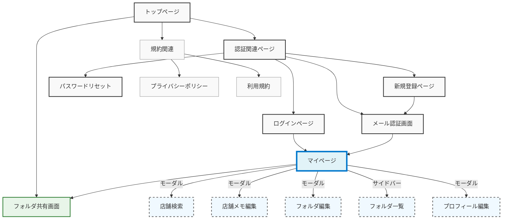

```mermaid
graph TD
    Top[トップページ]
    
    %% 認証前のページ群
    Auth[認証関連ページ]
    Auth --> Login[ログインページ]
    Auth --> Register[新規登録ページ]
    Auth --> PassReset[パスワードリセット]
    Auth --> EmailVerify[メール認証画面]
    
    %% 認証後のメインページ
    MyPage[マイページ]
    
    %% マイページ内の主要機能（モーダル/サイドバー）
    MyPage --> |モーダル| StoreSearch[店舗検索]
    MyPage --> |モーダル| StoreMemo[店舗メモ編集]
    MyPage --> |モーダル| FolderEdit[フォルダ編集]
    MyPage --> |サイドバー| FolderList[フォルダ一覧]
    MyPage --> |モーダル| ProfileEdit[プロフィール編集]
    
    %% 共有フォルダ（全ユーザーアクセス可能）
    SharedFolder[フォルダ共有画面]
    Top --> SharedFolder
    
    %% 規約関連ページ
    Docs[規約関連]
    Docs --> Privacy[プライバシーポリシー]
    Docs --> Terms[利用規約]
    
    %% ページ間の遷移関係
    Top --> Auth
    Top --> Docs
    Login --> MyPage
    Register --> EmailVerify
    EmailVerify --> MyPage
    MyPage --> SharedFolder
    
    %% スタイル設定
    classDef default fill:#f9f9f9,stroke:#333,stroke-width:2px
    classDef mainPage fill:#e1f3f8,stroke:#0077cc,stroke-width:4px
    classDef modal fill:#f0f9ff,stroke:#666,stroke-width:2px,stroke-dasharray: 5 5
    classDef docs fill:#f9f9f9,stroke:#999,stroke-width:1px
    classDef public fill:#e8f5e9,stroke:#2e7d32,stroke-width:2px
    
    class MyPage mainPage
    class StoreSearch,StoreMemo,FolderEdit,FolderList,ProfileEdit modal
    class Privacy,Terms,Docs docs
    class SharedFolder public
```