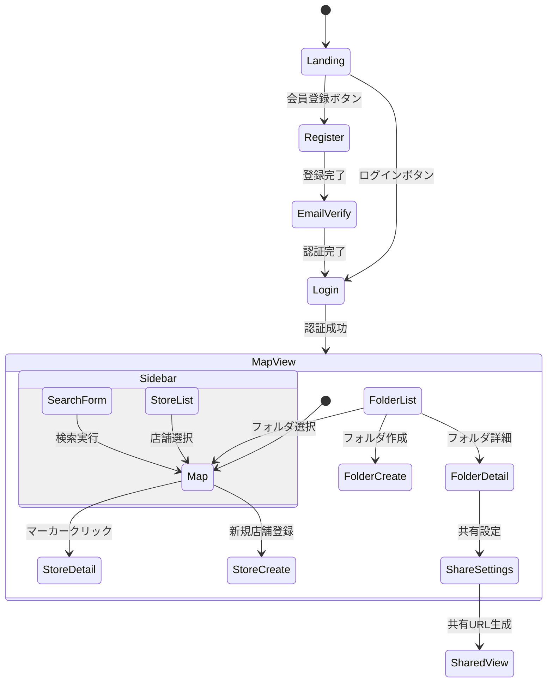

```mermaid
stateDiagram-v2
    [*] --> Landing
    Landing --> Login: ログインボタン
    Landing --> Register: 会員登録ボタン
    Register --> EmailVerify: 登録完了
    Login --> MapView: 認証成功
    EmailVerify --> Login: 認証完了

    state MapView {
        [*] --> Map
        Map --> StoreDetail: マーカークリック
        Map --> StoreCreate: 新規店舗登録
        
        state Sidebar {
            FolderList --> Map: フォルダ選択
            StoreList --> Map: 店舗選択
            SearchForm --> Map: 検索実行
        }
        
        FolderList --> FolderDetail: フォルダ詳細
        FolderList --> FolderCreate: フォルダ作成
        FolderDetail --> ShareSettings: 共有設定
    }

    ShareSettings --> SharedView: 共有URL生成
```