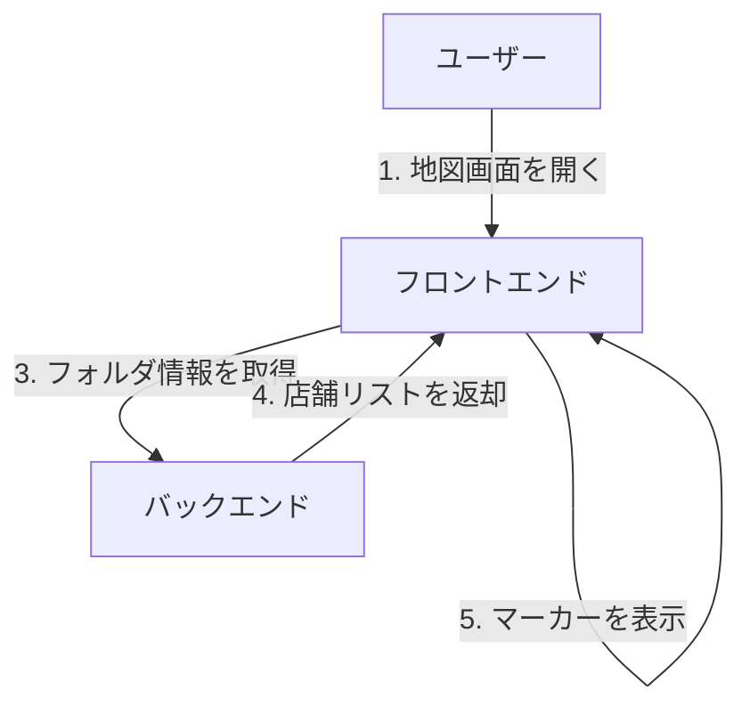
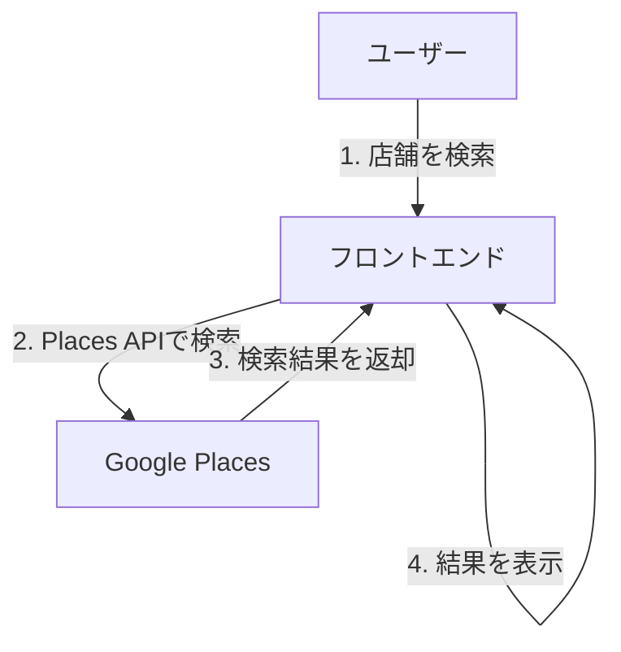

# API設計書 - Places API編

## 1. 基本方針

### 1.1 APIキーの管理
- Google Places APIキー：Vercelの環境変数で管理
- 環境変数名：`NEXT_PUBLIC_GOOGLE_MAPS_API_KEY`
- APIキーの制限設定：
  - 対象ドメインの制限（本番環境とVercelのプレビューURLのみ）
  - Places APIのみ許可

### 1.2 API呼び出しの分担
地図表示に関する処理は全てフロントエンド（Vercel）で行う：
1. 地図の表示
2. 店舗の検索
3. 店舗詳細の取得

## 2. API呼び出しフロー

### 2.1 地図表示時

### 2.2 店舗検索時

## 3. エラー処理
主なエラーケース：
1. APIキーが無効
2. クォータ（利用制限）超過
3. 検索結果が0件

対応方法：
- エラーメッセージをわかりやすく表示
- 再試行オプションの提供
- 管理者への通知（クォータ超過時）