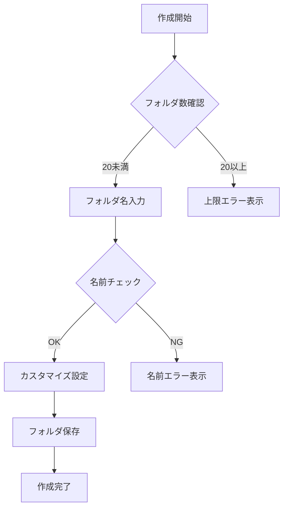

# TastyNote 機能設計書 - フォルダ管理機能（v2）

## 1. フォルダ管理機能概要

### 1.1 目的と方針
- シンプルで直感的なフォルダ管理システムの提供
- 少人数（30名程度）での利用を想定した設計
- メンテナンスコストを最小限に抑えた実装
- 必要最小限の機能に絞った構成

### 1.2 主要機能
1. フォルダの基本操作
   - 作成・編集・削除
   - 店舗の追加・削除
   - カスタマイズ（アイコン・カラー）

2. お気に入りフォルダ
   - アカウント作成時に自動生成
   - 固定の設定（名称・アイコン・カラー）
   - 削除不可・常に最上部表示

3. フォルダ共有機能
   - URLによる共有
   - 閲覧専用アクセス

## 2. 機能詳細

### 2.1 フォルダの基本仕様

#### 2.1.1 制限事項
- フォルダ数：1ユーザーあたり最大20個
- フォルダ名：最大20文字
- 構造：フラット構造（ネストなし）
- 並び順：
  1. お気に入りフォルダ（固定）
  2. ユーザー作成フォルダ（作成日時降順）

#### 2.1.2 フォルダ作成フロー


### 2.2 フォルダカスタマイズ機能

#### 2.2.1 カラー選択
| カラー名      | カラーコード | 使用用途           |
| ------------- | ------------ | ------------------ |
| Sky Blue      | #87CEEB      | デフォルト         |
| Forest Green  | #228B22      | 和食・自然系       |
| Sunset Orange | #FFA07A      | ランチ・カフェ     |
| Royal Purple  | #7B68EE      | バー・夜景         |
| Ruby Red      | #E0115F      | 肉料理・中華       |
| Golden Yellow | #FFD700      | お気に入り専用     |
| Ocean Blue    | #4169E1      | 海鮮・和食         |
| Rose Pink     | #FF69B4      | スイーツ・カフェ   |
| Slate Gray    | #708090      | ビジネス用         |
| Mint Green    | #98FF98      | 健康・ベジタリアン |

#### 2.2.2 アイコン選択
1. 飲食カテゴリー系（8種）
   - 和食：お椀アイコン
   - 洋食：フォーク＆ナイフ
   - カフェ：コーヒーカップ
   - バー：カクテルグラス
   - ラーメン：ラーメンどんぶり
   - 寿司：寿司
   - イタリアン：パスタ
   - 中華：中華鍋

2. 感情・状態表現系（7種）
   - お気に入り：星マーク
   - 要注意：ドクロマーク
   - 未訪問：時計
   - おすすめ：ハート
   - 記念日：ケーキ
   - 仕事用：ブリーフケース
   - その他：三点リーダー

### 2.3 お気に入りフォルダ機能

#### 2.3.1 基本仕様
- アカウント作成時に自動生成
- 固定設定：
  - 名称：「お気に入り」（変更不可）
  - アイコン：星マーク（変更不可）
  - カラー：Golden Yellow（変更不可）
- 操作制限：
  - 削除不可
  - 名称変更不可
  - カスタマイズ不可

### 2.4 フォルダ共有機能

#### 2.4.1 共有方法
- URLによる共有
  - 形式：https://{Domain}/share/folder/{hash}
  - hashは12文字のランダム英数字

#### 2.4.2 アクセス権限
1. オーナー（作成者）
   - フォルダの編集・削除
   - 店舗の追加・削除
   - 共有設定の管理
   - メモの編集

2. 閲覧者（共有URL経由）
   - フォルダ内容の閲覧
   - 店舗情報の閲覧
   - メモの閲覧
   - 地図表示の利用

## 3. エラーハンドリング

### 3.1 想定されるエラーと対応
| エラー種別     | エラーメッセージ                                   | 対応方法                   |
| -------------- | -------------------------------------------------- | -------------------------- |
| フォルダ数超過 | "フォルダは最大20個までです"                       | 不要なフォルダの削除を促す |
| 重複フォルダ名 | "同じ名前のフォルダが存在します"                   | 別の名前の入力を促す       |
| 無効な共有URL  | "このフォルダは存在しないか、共有が終了しています" | トップページへの誘導       |

### 3.2 エラー通知方法
- フロント：トースト形式で表示
  - 表示位置：画面下部中央
  - 表示時間：10秒
  - スタイル：Tailwind error/success/warning

## 4. データ構造

フォルダ管理機能で使用するテーブル構造やリレーションについては、「データベース設計書」を参照してください。

主な関連テーブル：
- folders：フォルダ基本情報
- folder_stores：フォルダと店舗の関連
- shared_folders：フォルダ共有情報

## 5. テスト方針

### 5.1 単体テスト
```php
/**
 * フォルダ管理機能の単体テスト
 */
class FolderManagementTest extends TestCase
{
    /** @test */
    public function フォルダを正常に作成できること()
    {
        // テストコード
    }

    /** @test */
    public function フォルダ数の上限を超えて作成できないこと()
    {
        // テストコード
    }

    /** @test */
    public function お気に入りフォルダは削除できないこと()
    {
        // テストコード
    }
}
```

### 5.2 テストケース
1. フォルダ基本操作
   - 正常系：作成、編集、削除
   - 異常系：制限超過、重複名

2. お気に入りフォルダ
   - 自動作成の確認
   - 削除防止の確認

3. 共有機能
   - URL生成
   - アクセス権限の確認