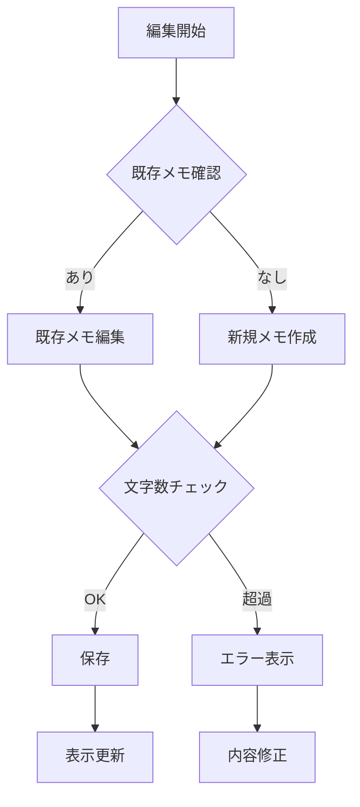

# TastyNote 機能設計書 - メモ機能（v2）

## 1. メモ機能概要

### 1.1 目的と方針
- シンプルで使いやすいメモ機能の提供
- 最小限の機能に絞った実装
- メンテナンスコストの最小化
- 低負荷での運用実現

### 1.2 主要機能
1. メモ基本機能
   - テキストメモの作成・編集
   - リアルタイム文字数カウンター
   - プレーンテキストのみ対応

2. メモの表示機能
   - 店舗詳細画面でのメモ表示
   - フォルダ一覧でのメモプレビュー
   - 共有フォルダでのメモ表示

## 2. 機能詳細

### 2.1 メモの基本仕様

#### 2.1.1 制限事項
- 形式：プレーンテキストのみ
- 最大文字数：500文字
- 改行：許可
- 絵文字：許可
- 1店舗につき1メモ
- URLの自動リンク化：あり

#### 2.1.2 メモ編集フロー


### 2.2 メモの表示機能

#### 2.2.1 表示パターン
1. 店舗詳細画面
   - フルテキスト表示
   - 編集ボタン（オーナーのみ）
   - 最終更新日時表示
   ```javascript
   /**
    * メモの詳細表示用コンポーネント
    * @param {string} memoContent - メモ内容
    * @param {boolean} isOwner - 編集権限の有無
    * @param {Date} updatedAt - 最終更新日時
    */
   const MemoDetailView = ({ memoContent, isOwner, updatedAt }) => {
     return (
       <div className="memo-detail">
         <div className="memo-content">
           {formatMemoContent(memoContent)}
         </div>
         {isOwner && (
           <button className="edit-button">
             編集
           </button>
         )}
         <div className="update-info">
           最終更新: {formatDate(updatedAt)}
         </div>
       </div>
     );
   };
   ```

2. フォルダ一覧
   - 先頭100文字をプレビュー表示
   - 省略記号（...）で残りを表現
   ```javascript
   /**
    * メモのプレビュー表示用関数
    * @param {string} content - メモの内容
    * @param {number} maxLength - 最大表示文字数
    * @returns {string} - 整形されたプレビューテキスト
    */
   function createMemoPreview(content, maxLength = 100) {
     if (!content) return '';
     if (content.length <= maxLength) return content;
     return content.substring(0, maxLength) + '...';
   }
   ```

3. 共有フォルダ画面
   - フルテキスト表示（読み取り専用）
   - 作成者名表示

### 2.3 メモ編集機能

#### 2.3.1 編集インターフェース
```javascript
/**
 * メモ編集コンポーネント
 * @param {string} initialContent - 初期メモ内容
 * @param {function} onSave - 保存時のコールバック
 */
const MemoEditor = ({ initialContent, onSave }) => {
  const [content, setContent] = useState(initialContent);
  const [charCount, setCharCount] = useState(initialContent.length);

  const handleChange = (e) => {
    const newContent = e.target.value;
    if (newContent.length <= 500) {
      setContent(newContent);
      setCharCount(newContent.length);
    }
  };

  return (
    <div className="memo-editor">
      <textarea
        value={content}
        onChange={handleChange}
        placeholder="メモを入力（最大500文字）"
        maxLength={500}
      />
      <div className="char-counter">
        {charCount}/500文字
      </div>
    </div>
  );
};
```

## 3. エラーハンドリング

### 3.1 想定されるエラー
1. 入力関連エラー
   - 文字数超過
   - 保存時のバリデーションエラー
   - 不正な文字の入力

2. 保存関連エラー
   - 通信エラー
   - 権限エラー
   - 同時編集の競合

### 3.2 エラー対応方法
| エラー種別 | エラーメッセージ           | 対応方法         |
| ---------- | -------------------------- | ---------------- |
| 文字数超過 | "メモは500文字までです"    | 入力を制限       |
| 保存失敗   | "メモの保存に失敗しました" | 再試行を促す     |
| 権限エラー | "編集権限がありません"     | 閲覧モードに切替 |

### 3.3 エラー通知方法
- インライン通知：文字数制限
- トースト通知：保存結果
- モーダル：重大なエラー

## 4. データ構造

メモ機能で使用するテーブル構造やリレーションについては、「データベース設計書」を参照してください。

主な関連テーブル：
- store_memos：店舗メモ情報

## 5. テスト方針

### 5.1 単体テスト
```javascript
/**
 * メモ機能のテストケース
 */
describe('メモ機能', () => {
  test('500文字までのメモを保存できること', () => {
    // テストコード
  });

  test('500文字を超えるメモは保存できないこと', () => {
    // テストコード
  });

  test('URLが自動でリンク化されること', () => {
    // テストコード
  });
});
```

### 5.2 テストシナリオ
1. メモ作成・編集
   - 正常系：メモの作成と保存
   - 異常系：文字数制限、不正な入力

2. メモ表示
   - プレビュー表示の正確性
   - URLのリンク化
   - 改行の適切な処理

3. 権限制御
   - 編集権限の確認
   - 共有時の表示制御