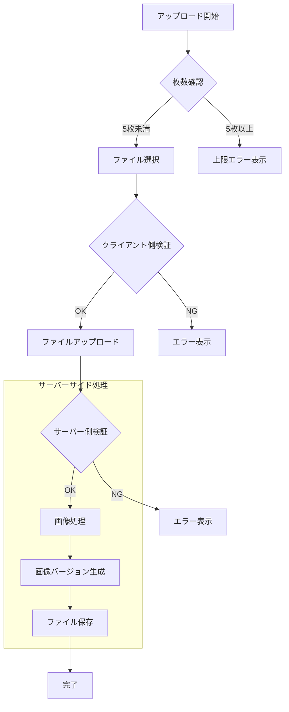

# TastyNote 機能設計書 - 写真管理機能（v2）

## 1. 写真管理機能概要

### 1.1 目的と方針
- 低コストでの写真管理機能の提供
- 必要最小限の機能に絞った実装
- ストレージ容量の効率的な利用
- シンプルな管理システムの実現

### 1.2 主要機能
1. 写真アップロード
   - 画像ファイルの選択
   - プレビュー表示
   - 自動リサイズ処理

2. 写真表示
   - サムネイル表示
   - 拡大表示
   - スライドショー

3. 写真管理
   - 写真の削除
   - 表示順序の管理

## 2. 機能詳細

### 2.1 写真アップロード機能

#### 2.1.1 制限事項
- 枚数制限：1店舗につき最大5枚
- サイズ制限：1枚あたり最大1MB
- 対応形式：JPEGのみ
- 画像サイズ
  - サムネイル：400x400px
  - 表示サイズ：800x800px
- 1ユーザーあたり：最大150MB
- 画質設定：80%（容量重視）

#### 2.1.2 アップロードフロー


#### 2.1.3 画像処理ロジック
```php
/**
 * 画像の前処理を行う
 * @param UploadedFile $file アップロードされた画像ファイル
 * @return array 処理結果の情報（オリジナルとサムネイルのパス）
 * @throws ImageProcessingException 画像処理に失敗した場合
 */
public function preprocessImage(UploadedFile $file): array
{
    try {
        // ImageMagickインスタンスの生成
        $image = new \Imagick($file->getPathname());
        
        // JPEG形式のチェックと変換
        if ($image->getImageFormat() !== 'JPEG') {
            $image->setImageFormat('JPEG');
        }
        
        // EXIF向きの補正
        $orientation = $image->getImageOrientation();
        if ($orientation !== \Imagick::ORIENTATION_UNDEFINED) {
            $this->autoRotateImage($image);
        }

        // 表示用画像の生成（最大800x800）
        $image->scaleImage(800, 800, true);
        $image->setImageCompression(\Imagick::COMPRESSION_JPEG);
        $image->setImageCompressionQuality(80);
        
        // サムネイル用画像の生成（400x400）
        $thumbnail = clone $image;
        $thumbnail->scaleImage(400, 400, true);
        $thumbnail->setImageCompressionQuality(60);
        
        // ファイルの保存
        $originalPath = $this->saveImage($image, 'original');
        $thumbnailPath = $this->saveImage($thumbnail, 'thumbnail');
        
        return [
            'original' => $originalPath,
            'thumbnail' => $thumbnailPath
        ];
    } catch (\ImagickException $e) {
        throw new ImageProcessingException('画像処理に失敗しました: ' . $e->getMessage());
    }
}

/**
 * EXIF情報に基づいて画像の向きを補正する
 * @param \Imagick $image 補正対象の画像
 */
private function autoRotateImage(\Imagick $image): void
{
    $orientation = $image->getImageOrientation();
    switch ($orientation) {
        case \Imagick::ORIENTATION_BOTTOMRIGHT:
            $image->rotateImage('#000', 180);
            break;
        case \Imagick::ORIENTATION_RIGHTTOP:
            $image->rotateImage('#000', 90);
            break;
        case \Imagick::ORIENTATION_LEFTBOTTOM:
            $image->rotateImage('#000', -90);
            break;
    }
    $image->setImageOrientation(\Imagick::ORIENTATION_TOPLEFT);
}
```

### 2.2 写真表示機能

#### 2.2.1 表示形式
1. サムネイル表示
   - グリッド形式でのレイアウト
   - Lazy Loading対応
   - ホバーでプレビュー
   ```vue
   <!-- StorePhotoGrid.vue -->
   <template>
     <div class="photo-grid">
       <template v-for="photo in photos" :key="photo.id">
         <div class="photo-item">
           
           <button
             v-if="isOwner"
             class="delete-button"
             @click="deletePhoto(photo.id)"
           >
             削除
           </button>
         </div>
       </template>
     </div>
   </template>
   ```

2. 拡大表示
   - モーダルウィンドウでの表示
   - 前後の写真への切り替え
   - スワイプ操作対応（モバイル）

### 2.3 ストレージ管理

#### 2.3.1 ディレクトリ構成
```
/photos
  /{user_id}
    /{store_id}
      - original/
      - thumbnail/
```

#### 2.3.2 容量管理
- アプリケーション全体：最大5GB
  - 写真ストレージ：4GB
  - その他：1GB

- ユーザーごとの制限
  - 最大容量：150MB
  - 警告表示：80%到達時
  - 自動削除：なし

## 3. エラーハンドリング

### 3.1 想定されるエラー
1. アップロード関連
   - ファイルサイズ超過
   - 非対応フォーマット
   - 枚数制限超過
   - ストレージ容量不足

2. 表示関連
   - 画像読み込み失敗
   - サムネイル生成失敗

### 3.2 エラー対応方針
| エラー種別 | エラーメッセージ                 | 対応方法             |
| ---------- | -------------------------------- | -------------------- |
| サイズ超過 | "画像サイズは1MBまでです"        | 自動リサイズの提案   |
| 形式エラー | "JPEGのみアップロード可能です"   | 対応形式の説明       |
| 枚数超過   | "1店舗につき5枚までです"         | 既存写真の削除を促す |
| 容量不足   | "ストレージ容量が不足しています" | 不要写真の削除を促す |

## 4. データ構造

写真管理機能で使用するテーブル構造やリレーションについては、「データベース設計書」を参照してください。

主な関連テーブル：
- store_photos：写真管理情報

## 5. テスト方針

### 5.1 単体テスト
```typescript
/**
 * 写真管理機能のテスト
 */
describe('写真管理機能', () => {
  test('JPEG画像をアップロードできること', () => {
    // テストコード
  });

  test('1MB以上の画像は自動でリサイズされること', () => {
    // テストコード
  });

  test('6枚目の画像はアップロードできないこと', () => {
    // テストコード
  });
});
```

### 5.2 テストケース
1. アップロード機能
   - 正常系：JPEG画像のアップロード
   - 異常系：サイズ超過、形式違い

2. 画像処理
   - リサイズ処理の正確性
   - サムネイル生成の品質

3. 表示機能
   - Lazy Loadingの動作
   - モーダル表示の確認

4. 容量管理
   - 制限値の適用
   - 警告表示の確認