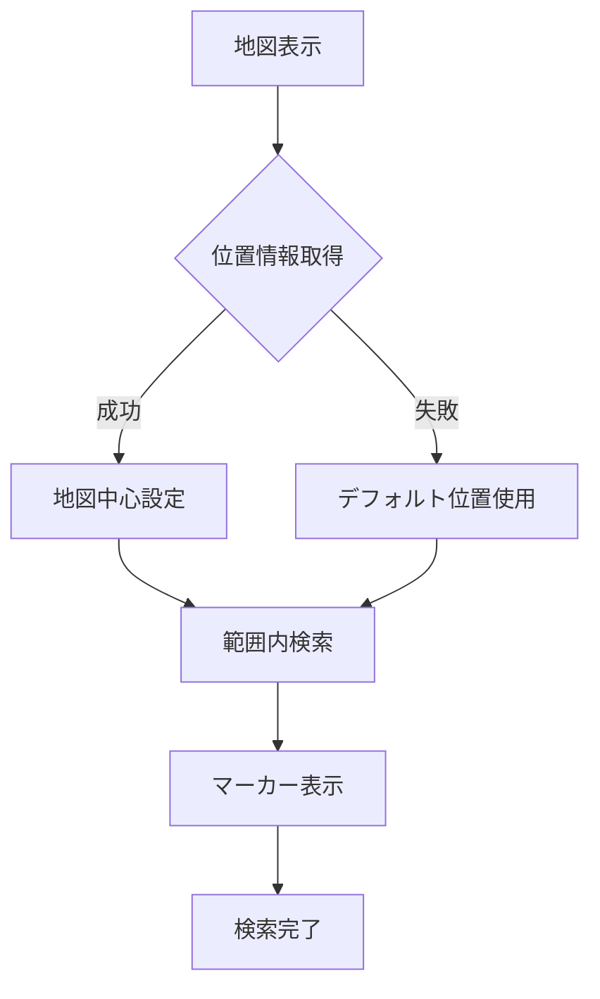

# TastyNote 機能設計書 - 店舗管理機能（v2）

## 1. 店舗管理機能概要

### 1.1 目的と方針
- Google Places APIを活用した正確な店舗情報の提供
- データベース負荷を最小限に抑えた設計
- シンプルで使いやすいインターフェースの実現
- 低コストでの運用を実現

### 1.2 主要機能
1. 店舗検索機能
   - キーワードによる検索
   - 地図からの検索
   - 現在地周辺の検索

2. 店舗情報表示機能
   - 基本情報の表示
   - 地図上での位置表示
   - メモの表示・編集

3. 地図表示機能
   - フォルダ単位での店舗表示
   - マーカーのカスタマイズ
   - クラスタリング表示

## 2. 機能詳細

### 2.1 店舗検索機能

#### 2.1.1 検索方法
1. キーワード検索
   ```javascript
   /**
    * Places APIを使用した店舗検索
    * @param {string} keyword - 検索キーワード
    * @param {Object} location - 検索の中心位置
    * @returns {Promise<Array>} - 検索結果の配列
    */
   async function searchPlaces(keyword, location) {
     const request = {
       query: keyword,
       location: location,
       radius: '1000',
       types: ['restaurant', 'cafe', 'bar']
     };
     
     return new Promise((resolve, reject) => {
       const service = new google.maps.places.PlacesService(map);
       service.textSearch(request, (results, status) => {
         if (status === google.maps.places.PlacesServiceStatus.OK) {
           resolve(results);
         } else {
           reject(new Error('Places API error: ' + status));
         }
       });
     });
   }
   ```

2. 地図検索フロー


### 2.2 店舗情報管理

#### 2.2.1 保存データ
- 必須データ
  - place_id（Google Places API用）
  - 登録日時
  - 登録ユーザーID
  - 所属フォルダID

- オプションデータ
  - メモ（最大500文字）
  - ユーザー写真（最大5枚）

#### 2.2.2 店舗情報表示
```javascript
/**
 * 店舗詳細情報の取得と表示
 * @param {string} placeId - Google Places API の place_id
 */
async function displayPlaceDetails(placeId) {
  const request = {
    placeId: placeId,
    fields: [
      'name',
      'formatted_address',
      'formatted_phone_number',
      'opening_hours',
      'photos',
      'website',
      'geometry'
    ]
  };

  const service = new google.maps.places.PlacesService(map);
  service.getDetails(request, handlePlaceDetails);
}
```

### 2.3 地図表示機能

#### 2.3.1 初期表示設定
- ズームレベル
  - 初期値：15（通り名や店舗が識別可能）
  - モバイル：14
  - タブレット/PC：15
  - 制限範囲：10-18

- 初期表示位置
  1. 現在地（位置情報取得成功時）
  2. デフォルト位置（東京駅: 35.681236, 139.767125）

#### 2.3.2 マーカー表示
```javascript
/**
 * フォルダに応じたマーカーのカスタマイズ
 * @param {Object} store - 店舗情報
 * @param {Object} folder - フォルダ情報
 * @returns {Object} - カスタマイズされたマーカーオプション
 */
function customizeMarker(store, folder) {
  return {
    position: store.geometry.location,
    map: map,
    icon: {
      path: getFolderIconPath(folder.icon),
      fillColor: folder.color,
      fillOpacity: 0.9,
      strokeWeight: 1,
      strokeColor: '#FFFFFF',
      scale: 1.2
    },
    title: store.name
  };
}
```

### 2.4 API利用の最適化

#### 2.4.1 API呼び出し制御
- リクエスト制限
  - 検索：1秒間に1回まで
  - 詳細情報取得：1秒間に2回まで

- エラーハンドリング
  - OVER_QUERY_LIMIT：待機後リトライ
  - ZERO_RESULTS：代替の検索候補を提示

```javascript
/**
 * API呼び出しの制御とエラーハンドリング
 * @param {Function} apiCall - 実行するAPI呼び出し関数
 * @returns {Promise} - API呼び出し結果
 */
async function handleApiCall(apiCall) {
  const maxRetries = 3;
  let retryCount = 0;

  while (retryCount < maxRetries) {
    try {
      return await apiCall();
    } catch (error) {
      if (error.code === 'OVER_QUERY_LIMIT') {
        await new Promise(resolve => setTimeout(resolve, 1000));
        retryCount++;
      } else {
        throw error;
      }
    }
  }
  
  throw new Error('API呼び出し上限を超過しました');
}
```

## 3. エラーハンドリング

### 3.1 想定されるエラーと対応
| エラー種別       | エラーメッセージ               | 対応方法             |
| ---------------- | ------------------------------ | -------------------- |
| API接続エラー    | "店舗情報の取得に失敗しました" | 3回までリトライ      |
| 位置情報取得失敗 | "現在地を取得できません"       | デフォルト位置を使用 |
| 検索結果なし     | "検索結果が見つかりません"     | 検索条件の変更を提案 |

### 3.2 エラー通知方法
- API関連エラー：コンソールログ記録
- ユーザー向けエラー：トースト通知
- 重大なエラー：エラーログ記録

## 4. データ構造

店舗管理機能で使用するテーブル構造やリレーションについては、「データベース設計書」を参照してください。

主な関連テーブル：
- stores：店舗基本情報（place_id）
- store_memos：店舗メモ情報
- store_photos：店舗写真情報

## 5. テスト方針

### 5.1 単体テスト
```javascript
/**
 * 店舗検索機能のテスト
 */
describe('店舗検索機能', () => {
  test('キーワードで店舗を検索できること', async () => {
    // テストコード
  });

  test('位置情報が取得できない場合はデフォルト位置を使用すること', async () => {
    // テストコード
  });
});
```

### 5.2 テストケース
1. 店舗検索
   - 正常系：検索結果の取得
   - 異常系：API制限、通信エラー

2. 地図表示
   - マーカー表示の正確性
   - クラスタリングの動作

3. エラーハンドリング
   - API制限時の動作
   - 位置情報非対応時の動作