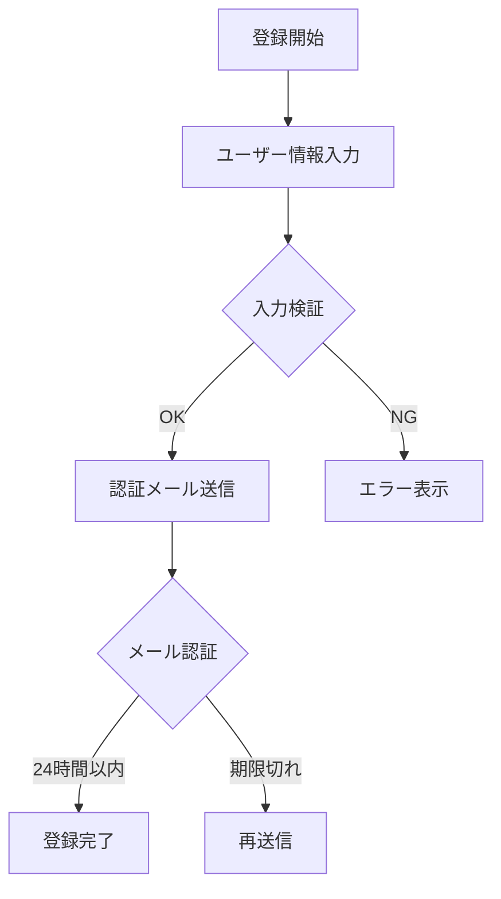
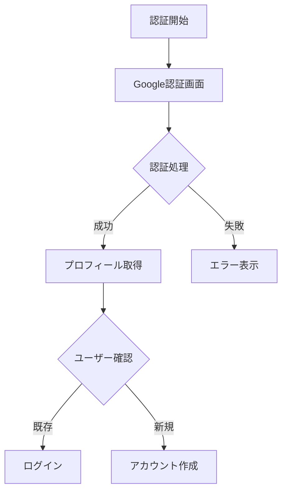

# TastyNote 機能設計書 - 認証機能（v3）

## 1. 認証機能概要

### 1.1 目的と方針
- 個人開発のポートフォリオに適した認証システムの提供
- メンテナンスコストを最小限に抑えた実装
- 必要十分なセキュリティレベルの確保
- 想定ユーザー数（30名程度）に適した設計
- ユーザーの利便性を重視（長期間のログイン維持）

### 1.2 認証方式
1. メールアドレス認証
   - メールアドレスとパスワードによる登録
   - メール認証による本人確認（24時間有効）
   - Laravel Fortifyを使用した実装

2. Google認証（SSO）
   - Laravel Socialiteを使用
   - 必要最小限の権限要求
     - プロフィール情報
     - メールアドレス

### 1.3 認証フロー
#### 1.3.1 メールアドレス認証


#### 1.3.2 Google認証


## 2. 実装詳細

### 2.1 基本設定
```php
// config/auth.php
return [
    'defaults' => [
        'guard' => 'web',
        'passwords' => 'users',
    ],
    'guards' => [
        'web' => [
            'driver' => 'session',
            'provider' => 'users',
        ],
    ],
    // セッションの有効期限：30日
    'session' => [
        'lifetime' => 43200, // 30日
        'secure' => true,    // HTTPS only
        'http_only' => true, // JavaScriptからアクセス不可
        'same_site' => 'lax' // CSRF対策
    ],
];
```

### 2.2 Google認証設定
```php
// config/services.php
return [
    'google' => [
        'client_id' => env('GOOGLE_CLIENT_ID'),
        'client_secret' => env('GOOGLE_CLIENT_SECRET'),
        'redirect' => env('APP_URL') . '/auth/google/callback',
    ],
];
```

### 2.3 ルーティング設定
```php
// routes/web.php
Route::middleware(['guest'])->group(function () {
    Route::get('/auth/google', 'Auth\SocialAuthController@redirectToGoogle');
    Route::get('/auth/google/callback', 'Auth\SocialAuthController@handleGoogleCallback');
});
```

## 3. セキュリティ要件

### 3.1 パスワードポリシー
- 文字数：8文字以上
- 必須文字：
  - 英大文字：1文字以上
  - 英小文字：1文字以上
  - 数字：1文字以上
- 禁止要素：
  - メールアドレスの文字列
  - 連続する数字（例：123456）
  - 同一文字の連続（例：aaaaaa）

### 3.2 アカウント保護
#### 3.2.1 基本設定
- ログイン試行制限：10回/30分
- セッション有効期限：30日
- パスワードリセットトークン：24時間有効

#### 3.2.2 実装方法
```php
/**
 * ログイン試行制限の設定
 */
class LoginController extends Controller
{
    use ThrottlesLogins;

    /**
     * 最大試行回数を定義
     */
    protected $maxAttempts = 10;

    /**
     * 試行回数リセットまでの時間（分）
     */
    protected $decayMinutes = 30;
}
```

## 4. エラーハンドリング

### 4.1 想定エラーと対応
| エラー種別         | エラーメッセージ                     | 対応方法           |
| ------------------ | ------------------------------------ | ------------------ |
| メール認証期限切れ | "認証用リンクの有効期限が切れました" | 再送信ボタンを表示 |
| ログイン試行超過   | "一時的にログインを制限しています"   | 残り時間を表示     |
| Google認証エラー   | "Google認証に失敗しました"           | 再試行ボタンを表示 |

### 4.2 エラー通知方法
- トースト形式で表示（シンプルに）
  - 表示位置：画面下部中央
  - 表示時間：5秒
  - スタイル：エラー（赤）、警告（黄）、情報（青）

### 4.3 ログ記録
```php
/**
 * 認証エラーのログ記録
 */
protected function logAuthError($type, $message, $context = [])
{
    Log::channel('auth')->error($message, [
        'type' => $type,
        'ip' => request()->ip(),
        'user_agent' => request()->userAgent(),
        ...$context
    ]);
}
```

## 5. データ構造

認証機能で使用するテーブル構造やリレーションについては、「データベース設計書」を参照してください。

主な関連テーブル：
- users：ユーザー基本情報
- password_reset_tokens：パスワードリセット管理
- login_attempts：ログイン試行記録

## 6. テスト方針

### 6.1 単体テスト
```php
/**
 * 認証機能の単体テスト
 */
class AuthenticationTest extends TestCase
{
    /** @test */
    public function メールアドレスとパスワードで正常にログインできること()
    {
        // テストコード
    }

    /** @test */
    public function Google認証で正常にログインできること()
    {
        // テストコード
    }

    /** @test */
    public function ログイン試行制限が正しく機能すること()
    {
        // テストコード
    }
}
```

### 6.2 テストケース
1. メール認証
   - 正常系：メール認証が完了し、ログインできる
   - 異常系：無効なトークン、期限切れ

2. Google認証
   - 正常系：認証完了、アカウント作成
   - 異常系：権限拒否、接続エラー

3. セキュリティ
   - パスワードポリシーの検証
   - ログイン試行制限の動作確認
   - セッション管理の検証