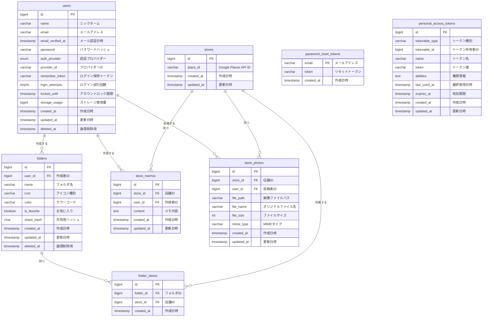

```mermaid
erDiagram
    users ||--o{ folders : "作成する"
    users ||--o{ store_memos : "作成する"
    users ||--o{ store_photos : "投稿する"
    folders ||--o{ folder_stores : "持つ"
    stores ||--o{ folder_stores : "所属する"
    stores ||--o{ store_memos : "持つ"
    stores ||--o{ store_photos : "持つ"

    users {
        bigint id PK
        varchar name "ニックネーム"
        varchar email "メールアドレス"
        timestamp email_verified_at "メール認証日時"
        varchar password "パスワードハッシュ"
        enum auth_provider "認証プロバイダー"
        varchar provider_id "プロバイダーID"
        varchar remember_token "ログイン保持トークン"
        tinyint login_attempts "ログイン試行回数"
        timestamp locked_until "アカウントロック期限"
        bigint storage_usage "ストレージ使用量"
        timestamp created_at "作成日時"
        timestamp updated_at "更新日時"
        timestamp deleted_at "論理削除用"
    }

    folders {
        bigint id PK
        bigint user_id FK "作成者ID"
        varchar name "フォルダ名"
        varchar icon "アイコン種別"
        varchar color "カラーコード"
        boolean is_favorite "お気に入り"
        char share_hash "共有用ハッシュ"
        timestamp created_at "作成日時"
        timestamp updated_at "更新日時"
        timestamp deleted_at "論理削除用"
    }

    stores {
        bigint id PK
        varchar place_id "Google Places API ID"
        timestamp created_at "作成日時"
        timestamp updated_at "更新日時"
    }

    store_memos {
        bigint id PK
        bigint store_id FK "店舗ID"
        bigint user_id FK "作成者ID"
        text content "メモ内容"
        timestamp created_at "作成日時"
        timestamp updated_at "更新日時"
    }

    store_photos {
        bigint id PK
        bigint store_id FK "店舗ID"
        bigint user_id FK "投稿者ID"
        varchar file_path "画像ファイルパス"
        varchar file_name "オリジナルファイル名"
        int file_size "ファイルサイズ"
        varchar mime_type "MIMEタイプ"
        timestamp created_at "作成日時"
        timestamp updated_at "更新日時"
    }

    folder_stores {
        bigint id PK
        bigint folder_id FK "フォルダID"
        bigint store_id FK "店舗ID"
        timestamp created_at "作成日時"
    }

    password_reset_tokens {
        varchar email PK "メールアドレス"
        varchar token "リセットトークン"
        timestamp created_at "作成日時"
    }

    personal_access_tokens {
        bigint id PK
        varchar tokenable_type "トークン種別"
        bigint tokenable_id "トークン所有者ID"
        varchar name "トークン名"
        varchar token "トークン値"
        text abilities "権限情報"
        timestamp last_used_at "最終使用日時"
        timestamp expires_at "有効期限"
        timestamp created_at "作成日時"
        timestamp updated_at "更新日時"
    }
```